|  Berliana Noviansyah  |      312010373     |
|-----------------------|--------------------|
|    Pemrograman Web    |      TI.20.A1      |
|     Pertemuan 12      |    Praktikum 11    |


# PRAKTIKUM 11 PERTEMUAN 12


## 1). Persiapan pertama


Sebelum memulai menggunakan Framework Codeigniter, perlu dilakukan konfigurasi pada webserver. Beberapa ekstenti PHP yang perlu diaktifkan untuk kebutuhan adalah sebagai berikut:
* **Php-json** ekstension untuk bekerja dengan JSON;
* **Php-mysqlnd** native driver untuk MySQL;
* **php-xml** ekstension untuk bekerja dengan XML;
* **php-intl** ekstensi untuk membuat aplikasi miltibahasa;
* **libcurl** (opsional), jika ingin pakai Curl.

Untuk mengaktifkan ekstensi tersebut, langkah pertama masuk kedalam aplikasi Xampp, lalu kil pada bagian **config**, setelah itu pilih **PHP (php.ini).

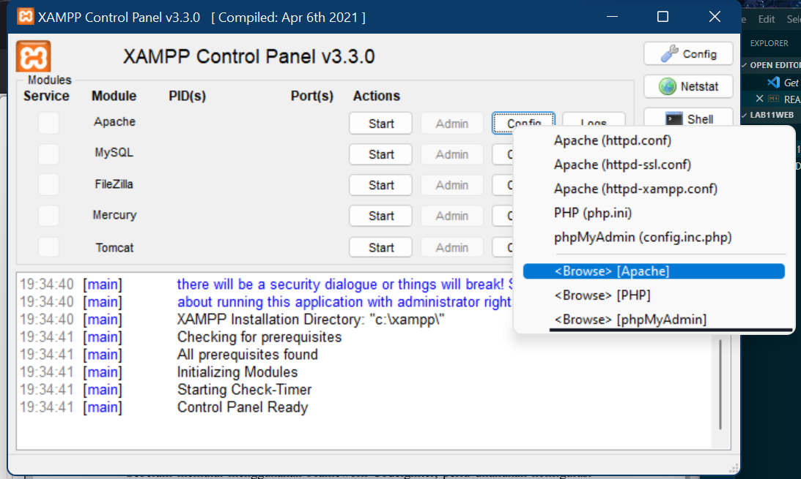


## 2). Installasi Codeigniter 4


* Install **Codeigniter** di website berikut : https://codeigniter.com/download
* Ekstrak file tersebut ke directory **htdocs/lab11_php_ci**.
* Ubah nama directory framework-4.x.x.x menjadi **ci4**.
* Lalu buka browser dengan alamat http://localhost/lab11web/lab11_php_ci/ci4/public/


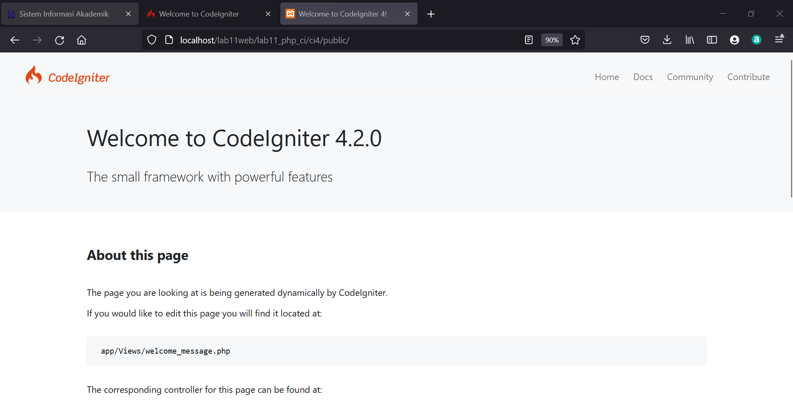


## 3). Menjalankan CLI *(Command Line Interface)*


Untuk mempermudah development atau pengembangannya, Codeigniter 4 menyediakan CLI yang dapat diakses melalui terminal atau command prompt.
Masuk pada folder xampp lalu cari file dengan nama *xampp.shell*. Klik untuk membuka CLI.


Arahkan okasi direktori sesuai dengan letak penyimpanan directory kerja dibuat. Misal, "xampp/**htdocs/lab11web/lab11_php_ci/ci4**)


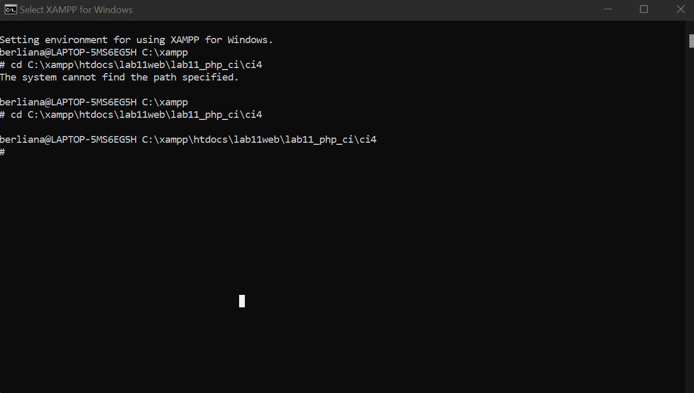


## 4). Memanggil Codeigniter


jalankan perintah

```php
php spark
```


Untuk memanggil CLI COdeigniter 4.

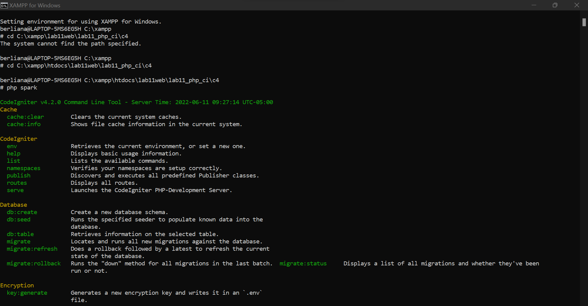


## 5) Mengaktifkan Code Debuggiing

Fitur debugging pada Codeigniter 4 digunakan untuk memudahkan developer mengetahui pesan arror apabila terjadi kesalahan dalam membuat kode program.
Ketika terjadi error pada aplikasi akan tampil pesan error sebagai berikut:


Semua jenis error akan ditampilakn sama. Untuk memudahkan mengetahui jenis errornya, maka perlu diaktifkan mode debugging dengan menguah nama file **env** menjadi **.env** kemudian buka file tersebut dan ubah nilai variable **envoironment** variable **CI_ENVIRONMENT"** menjadi **development**.


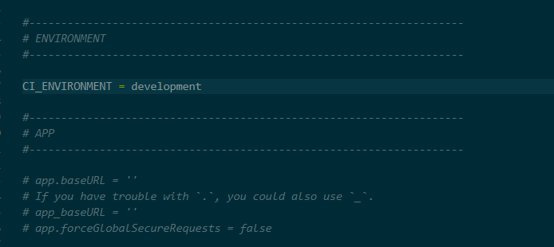


Lalu akses dengan localhost berikut : **localhost:8080**


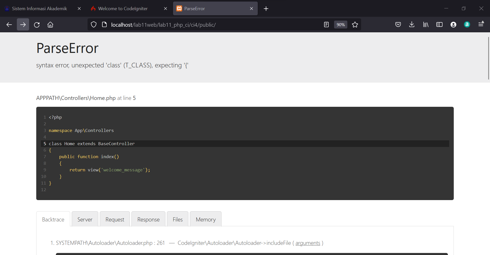

Untuk mencoba error tersebut, ubah kode pada file Home.php pada folder **app>Controller>Home.php** lalu hilangkan titik koma (;) pada akhir kode.


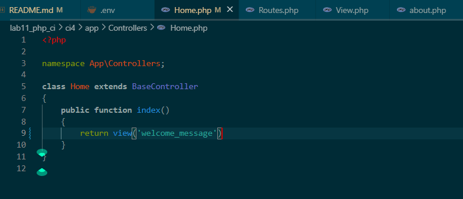


## 6). Routes

Pada Codeigniter, request yang diterima oleh file index.php akan diarahkan ke Router untuk meudian oleh router tersebut diarahkan ke Controller.

Router terletak pada folder **app>config>Routes.php**.

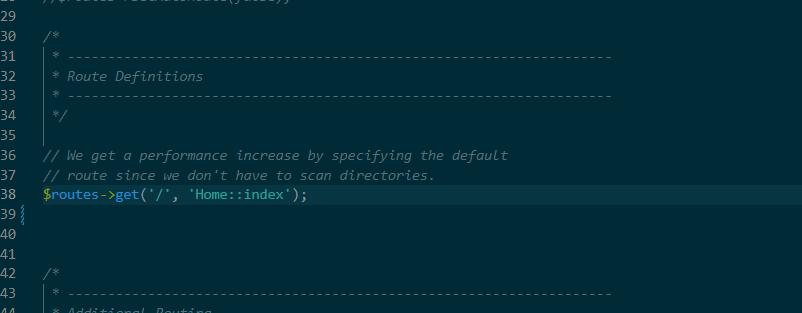


Pada file tersebut kita dapat mendefinisikan route untuk aplikasi yang kita buat.

Contoh:

```php
$route->get('/', 'Home::index');
```


Kode tersebut akan mengarahkan rute untuk halaman home.


## 7). Membuat Route Baru


Tambahkan code berikut kedalam Routes.php

```php
$routes->get('/about','Page::about');
$routes->get('/contact','Page::contact');
$routes->get('/faqs','Page::faqs');
```

Untuk mengetahui route yang ditambahkan sudah benar, buka CLI dan jalankan:

```php
php spark routes
```


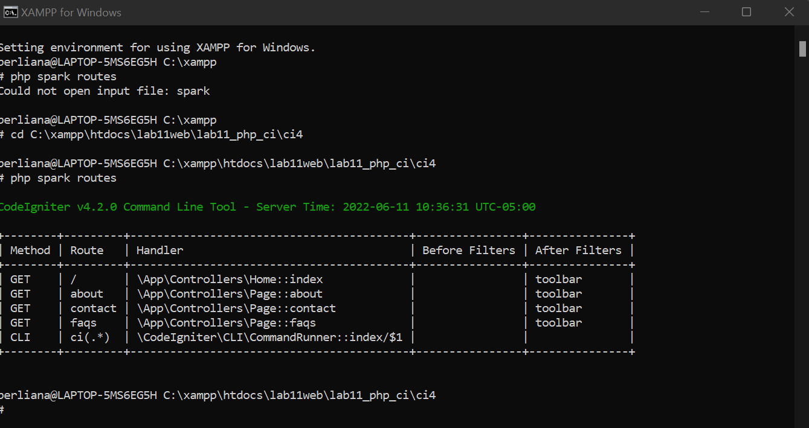


Kemudian akses route tersebut dengan mengakses url : http:/localhost:8080/about

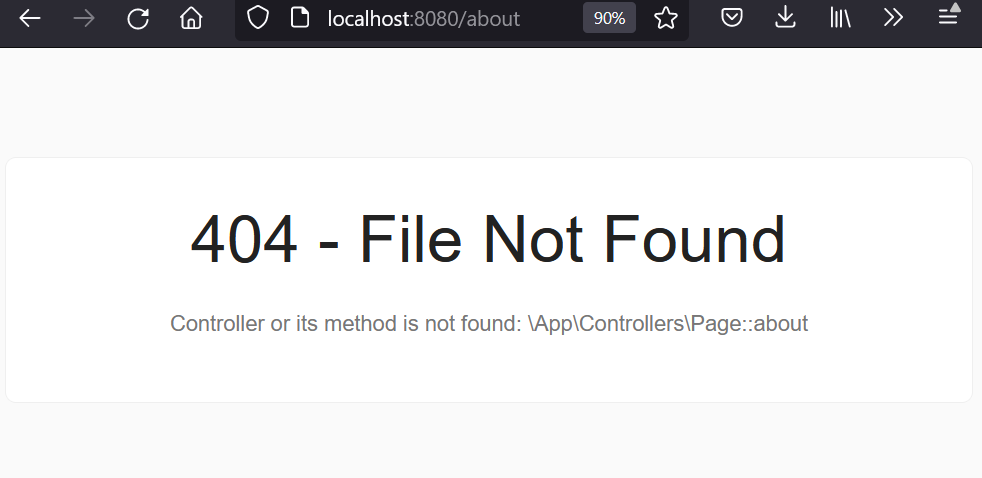


Halaman yang diakses akan muncul tampilan error 404 file not found, artinya file/page tersebut tidak ada. Untuk dapat mengakses halaman tersebut, ahrus dibuat terlebih dahulu Controller yang sesuai dengan routing yang dibuat yaitu Controller Page.


## 8). Membuat Controller

membuat controller page dengan cara buat file baru dengan nama **page.php** pada directory Controller kemudian isi kodenya sepert berikut:

```php
<?php

namespace App\controllers;

class Page extends BaseController
{
    public function about()
    {
        return view('about', [
            'title' => 'Halaman About','content' => 'Ini Adalah Halaman About Yang Menjelaskan Tentang Isi Halaman Ini.'
        ]);
    }
    public function contact()
    {
        echo "Ini Halaman Contact";
    }
    public function faqs()
    {
        echo "Ini Halaman Faqs";
    }
}
```


Lalu refresh kembali browser, maka akan muncul tampilan yang sudah dapat diakses.


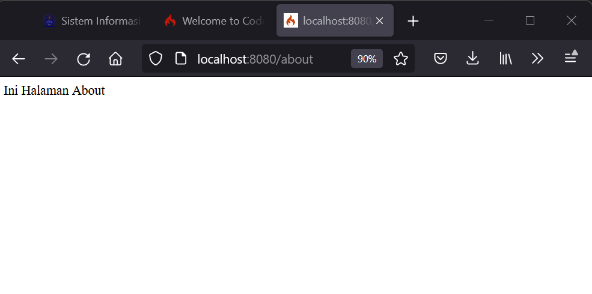


