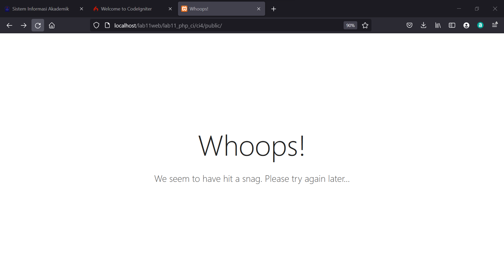

|  Berliana Noviansyah  |      312010373     |
|-----------------------|--------------------|
|    Pemrograman Web    |      TI.20.A1      |
|     Pertemuan 12      |    Praktikum 11    |


# PRAKTIKUM 11 PERTEMUAN 12


## 1). Persiapan pertama


Sebelum memulai menggunakan Framework Codeigniter, perlu dilakukan konfigurasi pada webserver. Beberapa ekstenti PHP yang perlu diaktifkan untuk kebutuhan adalah sebagai berikut:
* **Php-json** ekstension untuk bekerja dengan JSON;
* **Php-mysqlnd** native driver untuk MySQL;
* **php-xml** ekstension untuk bekerja dengan XML;
* **php-intl** ekstensi untuk membuat aplikasi miltibahasa;
* **libcurl** (opsional), jika ingin pakai Curl.

Untuk mengaktifkan ekstensi tersebut, langkah pertama masuk kedalam aplikasi Xampp, lalu kil pada bagian **config**, setelah itu pilih **PHP (php.ini).


## 2). Installasi Codeigniter 4


* Install **Codeigniter** di website berikut : https://codeigniter.com/download
* Ekstrak file tersebut ke directory **htdocs/lab11_php_ci**.
* Ubah nama directory framework-4.x.x.x menjadi **ci4**.
* Lalu buka browser dengan alamat http://localhost/lab11web/lab11_php_ci/ci4/public/


## 3). Menjalankan CLI *(Command Line Interface)*


Untuk mempermudah development atau pengembangannya, Codeigniter 4 menyediakan CLI yang dapat diakses melalui terminal atau command prompt.
Masuk pada folder xampp lalu cari file dengan nama *xampp.shell*. Klik untuk membuka CLI.


Arahkan okasi direktori sesuai dengan letak penyimpanan directory kerja dibuat. Misal, "xampp/**htdocs/lab11web/lab11_php_ci/ci4**)


## 4). Memanggil Codeigniter


jalankan perintah

```php
php spark
```


Untuk memanggil CLI COdeigniter 4.


## 5) Mengaktifkan Code Debugging

Fitur debugging pada Codeigniter 4 digunakan untuk memudahkan developer mengetahui pesan arror apabila terjadi kesalahan dalam membuat kode program.
Ketika terjadi error pada aplikasi akan tampil pesan error sebagai berikut:




Semua jenis error akan ditampilakn sama. Untuk memudahkan mengetahui jenis errornya, maka perlu diaktifkan mode debugging dengan menguah nama file **env** menjadi **.env** kemudian buka file tersebut dan ubah nilai variable **envoironment** variable **CI_ENVIRONMENT"** menjadi **development**.


Lalu akses dengan localhost berikut : **localhost:8080**


Untuk mencoba error tersebut, ubah kode pada file Home.php pada folder **app>Controller>Home.php** lalu hilangkan titik koma (;) pada akhir kode.


## 6). Routes

Pada Codeigniter, request yang diterima oleh file index.php akan diarahkan ke Router untuk meudian oleh router tersebut diarahkan ke Controller.

Router terletak pada folder **app>config>Routes.php**.


Pada file tersebut kita dapat mendefinisikan route untuk aplikasi yang kita buat.

Contoh:

```php
$route->get('/', 'Home::index');
```


Kode tersebut akan mengarahkan rute untuk halaman home.


## 7). Membuat Route Baru


Tambahkan code berikut kedalam Routes.php

```php
$routes->get('/about','Page::about');
$routes->get('/contact','Page::contact');
$routes->get('/faqs','Page::faqs');
```

Untuk mengetahui route yang ditambahkan sudah benar, buka CLI dan jalankan:

```php
php spark routes
```


Kemudian akses route tersebut dengan mengakses url : http:/localhost:8080/about


Halaman yang diakses akan muncul tampilan error 404 file not found, artinya file/page tersebut tidak ada. Untuk dapat mengakses halaman tersebut, ahrus dibuat terlebih dahulu Controller yang sesuai dengan routing yang dibuat yaitu Controller Page.


## 8). Membuat Controller

membuat controller page dengan cara buat file baru dengan nama **page.php** pada directory Controller kemudian isi kodenya sepert berikut:

```php
<?php

namespace App\controllers;

class Page extends BaseController
{
    public function about()
    {
        return view('about', [
            'title' => 'Halaman About','content' => 'Ini Adalah Halaman About Yang Menjelaskan Tentang Isi Halaman Ini.'
        ]);
    }
    public function contact()
    {
        echo "Ini Halaman Contact";
    }
    public function faqs()
    {
        echo "Ini Halaman Faqs";
    }
}
```


Lalu refresh kembali browser, maka akan muncul tampilan yang sudah dapat diakses.


## 9) Auto Rooting

Secara default fitur *autoroute* pada Codeigniter sudah aktif. Untuk mengubah status *autoroute* dapat mengubah nilai variablenya. Untuk menonaktifkannya cukup ubah **true** menjadi **false**.

```php
$routes->setAutoRoute(true);
```


Lalu tambahkan method baru pada Controller Page seperti berikut:


```php
 public function tos()
    {
        echo "Ini Halaman Term of Services";
    }
}
```


Method ini belum ada pada routing, sehingga cara mengaksesnya dengan menggunakan alamat : http://localhost:8080/page/tos


## 10). Membuat View

Selanjutnya membuat view untuk tampilan web agar menarik. Buat file baru dengan nama about.php pada directory view **(app>view/about.php)**. Kemudian isi kodenya seperti berikut:

```php
<!DOCTYPE html>
<html lang="en">
<head>
    <meta charset="UTF-8">
    <title><?= $title; ?></title>
</head>
<body>
    <h1><?= $title; ?></h1>
    <hr>
    <p><?= $content; ?></p>
</body>
</html>
```


Ubah **method about** pada class Controller Page menjadi seperti berikut:

```php
  public function about()
    {
        return view('about', [
            'title' => 'Halaman About','content' => 'Ini Adalah Halaman About Yang Menjelaskan Tentang Isi Halaman Ini.'
        ]);
    }
```


Kemudian refresh pada halaman tersebut.


## 11). Membuat Layout web dengan CSS


Pada dasarnya, layout web dengan css diimplementasikan dengan mudah pada Codeigniter. Yang perlu diketahui adalah, pada Codeigniter 4 file yang menyimpan asset css dan javascript terletak pada directory public.

Untuk memudahkannya, copy file css dari praktikum **lab4web** yang akan digunakan untuk layout tugas saat ini.


Kemudian buat folder **template** pada directory **view** kemudian buat file **header.php** dan **footer.php**.


Lokasi penyimpanan file **(app>view>template>header.php)**.

```php
<!DOCTYPE html>
<html lang="en">
<head>
    <meta charset="UTF-8">
    <link rel="stylesheet" href="<?= base_url('/style.css');?>">
</head>
<body>
    <div id="container">
    <header>
        <h1>Layout Sederhana</h1>
    </header>
    <nav>
        <a href="<?= base_url('/');?>" class="active">Home></a>
        <a href="<?= base_url('/artikel');?>">Artikel></a>
        <a href="<?= base_url('/about');?>">About></a>
        <a href="<?= base_url('/contact');?>">Contact></a>
    </nav>
    <section id="wrapper">
        <section id="main">
```


Lokasi penyimpanan 2 **(app>view>template>footer.php)**.

```php
 </section>
    <aside id="sidebar">
        <div class="widget-box">
            <h3 class="title">Widget Header</h3>
            <ul>
                <li><a href="#">Widget Link</a></li>
                <li><a href="#">Widget Link</a></li>
            </ul>
        </div>
        <div class="widget-box">
            <h3 class="title">Widget Text</h3>
            <p>Vestibulum lorem elit, iaculis in nisl volutpat, malesuada
tincidunt arcu. Proin in leo fringilla, vestibulum mi porta, faucibus felis.
Integer pharetra est nunc, nec pretium nunc pretium ac.</p>
            </div>
        </aside>
    </section>
    <footer>
        <p>&copy; 2021 - Universitas Pelita Bangsa</p>
    </footer>
    </div>
</body>
</html>
```


Kemudian ubah isi file about.php sebagai berikut:

```php
<?= $this->include('template/header'); ?>
<h1><?= $title; ?></h1>
<hr>
<p><?= $content; ?></p>
<?= $this->include('template/footer'); ?>
```

Selanjutnya refresh tampilan pada alamat : http://localhost:8080/about


=========================================================

# PRAKTIKUM 12 PERTEMUAN 13


## 1). Membuat Database

```sql
CREATE DATABASE lab_ci4;
```

**Lalu buatlah tabel sebagai berikut:**

```sql
CREATE TABLE artikel (
    id INT(11) auto_increment,
    judul VARCHAR(200) NOT NULL,
    isi TEXT,
    gambar VARCHAR(200),
    status TINYINT(1) DEFAULT 0,
    slug VARCHAR(200),
    PRIMARY KEY(id)
);
```


## 2). Konfigurasi Koneksi Database


Selanjutlah lakukanlah konfigurasi database untuk menghubungkannya dengan server. Dapat dilakukan dengan dua cara yaitu:
* File **app>config>database.php**; atau,
* Konfigurasi pada file **.env** seperti contoh dibawah ini:


## 3). Membuat Model


Yang akan digunakan untuk memproses data artikel. Buat file baru pada directory **app>Models** dengan nama file **ArtikelModel.php**.


```php
<?php

namespace App\Models;

use CodeIgniter\Model;

class ArtikelModel extends Model
{
    protected $table = 'artikel';
    protected $primaryKey = 'id';
    protected $useAutoIncrement = true;
    protected $allowedFields = ['judul', 'isi', 'status', 'slug', 'gambar'];
}
```


## 4). Membuat Controller


Buatlah controller baru dengan nama **Artikel.php** pada directory **app>Controllers**.


```php
<?php

namespace App\Controllers;

use App\Models\ArtikelModel;

class Artikel extends BaseController
{
    public function index()
    {
        $title = 'Daftar Artikel';
        $model = new ArtikelModel();
        $artikel = $model->findAll();
        return view('artikel/index', compact('artikel', 'title'));
    }
}
```


## 5). Membuat View

Lalu buat directory baru dengan nama artikel pada directory **app>views**, kemudian buat file baru dengan nama **index.php**.


```php
<?= $this->include('template/header'); ?>

<?php if($artikel): foreach($artikel as $row): ?>
<article class="entry">
    <h2><a href="<? base_url('/artikel/' . $row['slug']);?>"><?= $row['judul']; ?></a>
</h2>
    " alt="<?= $row['judul']; ?>">
    <p><?= substr($row['isi'], 0, 200); ?></p>
</article>
<hr class="divider" />
<?php endforeach; else: ?>
<article class="entry">
    <h2>Belum Ada Data Yang di Input.</h2>
</article>
<?php endif; ?>

<?= $this->include('template/footer'); ?>
```


Lalu buka kembali browser dengan mengakses url http://localhost:8080/artikel


Kemudian tambahkan beberapa data pada database agar data dapat ditampilkan.

```sql
INSERT INTO artikel (judul, isi, slug) VALUE
('Artikel pertama', 'Lorem Ipsum adalah contoh teks atau dummy dalam industri
percetakan dan penataan huruf atau typesetting. Lorem Ipsum telah menjadi
standar contoh teks sejak tahun 1500an, saat seorang tukang cetak yang tidak
dikenal mengambil sebuah kumpulan teks dan mengacaknya untuk menjadi sebuah
buku contoh huruf.', 'artikel-pertama'),
('Artikel kedua', 'Tidak seperti anggapan banyak orang, Lorem Ipsum bukanlah
teks-teks yang diacak. Ia berakar dari sebuah naskah sastra latin klasik dari
era 45 sebelum masehi, hingga bisa dipastikan usianya telah mencapai lebih
dari 2000 tahun.', 'artikel-kedua');
```


Lalu refresh kembali browser, dan data akan muncul.


## 6). Membuat Tampilan Detail Artikel

Tampilan pada saat judul berita di klik, maka akan diarahkan ke halaman yang berbeda. Tambahkan fungsi baru pada **Controller Artikel** dengan nama **view()**.


```php
 // View ()
    public function view($slug)
    {
        $model = new ArtikelModel();
        $artikel = $model->where([
            'slug' => $slug
        ])->first();

        // Menampilkan error apabila tidak ada data.

        if (!$artikel)
        {
            throw PageNotFoundExeption::forPageNotFound();
        }

        $title = $artikel['judul'];
        return view('artikel/detail', compact('artikel', 'title'));
    }
```


## 7). Membuat View Detail


Buat file baru untuk halaman detail dengan nama **Detail.php** pada **app>views>artikel**.


```php
<?= $this->include('template/header'); ?>

<article class="entry">
    <h2><?= $artikel['judul']; ?></h2>
    " alt="<?= $artikel['judul']; ?>">
    <p><?= $artikel['isi']; ?></p>
</article>

<?= $this->include('template/footer'); ?>
```


## 8). Membuat Routing Untuk Artikel Detail

Buka file config **Raouter.php** pada directory **app>config>Routes.php**, kemudian tambah routing untuk artikel detail.

```php
$routes->get('/artikel/(:any)', 'Artikel::view/$1');
```


## 9). Membuat Menu Admin


Menu admin berguna sebagai proses CRUD data artikel. Buat mrthod baru pada **Controller** di file **artikel** dengan nama **admin_index().

```php
public function admin_index()
    {
        $title = 'Daftar Artikel';
        $model = new ArtikelModel();
        $artikel = $model->findAll();
        return view('artikel/admin_index', compact('artikel', 'title'));
    }
```


Lalu buat tampilan dengan nama **admin_index** pada folder **view**.


```php
<?= $this->include('template/admin_header'); ?>

<table class="table">
    <thead>
        <tr>
            <th>ID</th>
            <th>Judul</th>
            <th>Status</th>
            <th>Aksi</th>
        </tr>
    </thead>
    <tbody>
    <?php if($artikel): foreach($artikel as $row): ?>
        <tr>
            <td><?= $row['id']; ?></td>
            <td>
                <b><?= $row['judul']; ?></b>
                <p><small><?= substr($row['isi'], 0, 50); ?></small></p>
            </td>
            <td><?= $row['status']; ?></td>
            <td>
                <a class="btn" href="<?= base_url('/admin/artikel/edit/' . $row['id']);?>">Ubah</a>
                <a class="btn btn-danger" onclick="return confirm('Yakin Menghapus Data?');" href="<?= base_url('/admin/artikel/delete/' . $row['id']);?>">Hapus</a>
            </td>
        </tr>
        <?php endforeach; else: ?>
        <tr>
            <td colspan="4">Belum Ada Data.</td>
        </tr>
        <?php endif; ?>
    </tbody>
    <tfoot>
        <tr>
            <th>ID</th>
            <th>Judul</th>
            <th>Status</th>
            <th>Aksi</th>
        </tr>
    </tfoot>
</table>

<?= $this->include('template/admin_footer'); ?>
```


Lalu tambahkan routing untuk meni admin seperti berikut:

```php
$routes->group('admin', function($routes) {
    $routes->get('artikel', 'Artikel::admin_index');
    $routes->add('artikel/add', 'Artikel::add');
    $routes->add('artikel/edit/(:any)', 'Artikel::edit/$1');
    $routes->get('artikel/delete/(:any)', 'Artikel::delete/$1');
});
```


Setelahnya, akses menu admin dengan url berikut: http://localhost:8080/admdin/artikel


## 10). Menambah Data Artikel

tambahkan fungsi method baru pada **Controller** pada file **artikel** dengan nama **add()**.

```php
 public function add()
    {
        // Validasi Data.
        $validation = \Config\Services::validation();
        $validation->setRules(['judul' => 'required']);
        $isDataValid = $validation->withRequest($this->request)->run();

        if ($isDataValid)
        {
            $artikel = new ArtikelModel();
            $artikel->insert([
                'judul' => $this->request->getPost('judul'),
                'isi' => $this->request->getPost('isi'),
                'slug' => url_title($this->request->getPost('judul')),
            ]);
            return redirect('admin/artikel');
        }
        $title = "Tambah Artikel";
        return view('artikel/form_add', compact('title'));
    }
```


Kemudian buat tampilan untuk form tambah dengan nama **add_php** pada folder **view**.


```php
<?= $this->include('template/admin_header'); ?>

<h2><?= $title; ?></h2>
<form action="" method="post">
    <p>
        <input type="text" name="judul">
    </p>
    <p>
        <textarea name="isi" cols="50" rows="10"></textarea>
    </p>
    <p><input type="submit" value="Kirim" class="btn btn-large"></p>
</form>

<?= $this->include('template/admin_footer'); ?>
```


## 11). Mengubah Data

Tambahkan fungsi atau method baru pada **Controller artikel** dengan nama edit().

```php
public function edit($id)
    {
        $artikel = new ArtikelModel();
        
        // validasi data.
        $validation = \Config\Services::validation();
        $validation->setRules(['judul' => 'required']);
        $isDataValid = $validation->withRequest($this->request)->run();

        if ($isDataValid)
        {
            $artikel->update($id, [
                'judul' => $this->request->getPost('judul'),
                'isi' => $this->request->getPost('isi'),
            ]);
            return redirect('admin/artikel');
        }

        // ambil data lama
        $data = $artikel->where('id', $id)->first();
        $title = "Edit Artikel";
        return view('artikel/form_edit', compact('title', 'data'));
    }
```


Kemudian buat tampilan untuk form edit pada folder **view** dengan nama **form_edit.php**.


```php
<?= $this->include('template/admin_header'); ?>

<h2><?= $title; ?></h2>
<form action="" method="post">
    <p>
        <input type="text" name="judul" value="<?= $data['judul'];?>" >
    </p>
    <p>
        <textarea name="isi" cols="50" rows="10"><?=
$data['isi'];?></textarea>
    </p>
    <p><input type="submit" value="Kirim" class="btn btn-large"></p>
</form>

<?= $this->include('template/admin_footer'); ?>
```


## 12). Menghapus data

```php
public function delete($id)
    {
        $artikel = new ArtikelModel();
        $artikel->delete($id);
        return redirect('admin/artikel');
    }
```

=========================================================


# PRAKTIKUM 13 PERTEMUAN 14


## 1). Membuat Table User Login


```php
CREATE TABLE user (
id INT(11) auto_increment,
username VARCHAR(200) NOT NULL,
useremail VARCHAR(200),
userpassword VARCHAR(200),
PRIMARY KEY(id)
);
```


## 2). Membuat Model User


Selanjutnya adalah membuat model untuk memproses data Login. Buat file baru pada directory **App>Models** dengan nama **UserModel.php**.


```php
<?php

namespace App\Models;

use CodeIgniter\Model;

class UserModel extends Model

{
    protected $table = 'user';
    protected $primaryKey = 'id';
    protected $useAutoIncrement = true;
    protected $allowedFields = ['username', 'useremail', 'userpassword'];
}
```


## 3). Membuat Controller User


Lalu buat controller baru dengan nama **User.php** pada directory **App>Controllers**. Kemudian tambahkan moetjod **index()** untuk menampilkan daftar user, dan method **login()** untuk proses login.


```php
<?php

namespace App\Controllers;

use App\Models\UserModel;

class User extends BaseController
{
    public function index()
    {
        $title = 'Daftar User';
        $model = new UserModel();
        $users = $model->findAll();
        return view('user/index', compact('users', 'title'));
    }

    public function login()
    {
        helper(['form']);
        $email = $this->request->getPost('email');
        $password = $this->request->getPost('password');
        if (!$email)
        {
            return view('user/login');
        }

        $session = session();
        $model = new UserModel();
        $login = $model->where('useremail', $email)->first();
        if ($login)
        {
            $pass = $login['userpassword'];
            if (password_verify($password, $pass))
            {
                $login_data = [
                    'user_id' => $login['id'],
                    'user_name' => $login['username'],
                    'user_email' => $login['useremail'],
                    'logged_in' => TRUE,
                ];
                $session->set($login_data);
                return redirect('admin/artikel');
            }
            else
            {
                $session->setFlashdata("flash_msg", "Password Salah.");
                return redirect()->to('/user/login');
            }
        }
        else
        {
            $session->setFlashdata("flash_msg", "Email Tidak Terdaftar.");
            return redirect()->to('/user/login');
        }
    }

    public function logout()
    {
        session()->destroy();
        return redirect()->to('/user/login');
    }
}
```


## 4). Membuat View Login


Selanjutnya buat directory baru dengan nama **user** pada directory **App>Views**, kemudian buat file baru dengan nama login.php.


```php
<!DOCTYPE html>
<html lang="en">
<head>
    <meta charset="UTF-8">
    <title>Login</title>
    <link rel="stylesheet" href="<?= base_url('/user.css');?>">
</head>
<body>
    <div id="login-wrapper">
        <h1> Sign In</h1>
        <?php if(session()->getFlashdata('flash_msg')):?>
            <div class="alert alert-danger"><?= session()->getFlashdata('flash_msg') ?></div>
            <?php endif;?>
            <form action="" method="post">
                <div class="mb-3">
                    <label for="InputForEmail" class="form-label">Email Address</label>
                    <input type="email" name="email" class="form-control" id="InputForEmail" value="<?= set_value('email') ?>">
                </div>
                <div class="mb-3">
                    <label for="InputForPassword" class="form-label">Password</label>
                    <input type="password" name="password" class="form-control" id="InputForPassword">
                </div>
                <button type="submit" class="btn btn-primary">Login</button>
            </form>
    </div>
</body>
</html>
```


## 5). Membuat database Seeder


Database seeder digunakan untuk membuat data dummy dengan keperluan ujicoba modul login, kita perlu memasukkan data user dan password kedalam database. Untuk itu buat database seeder untuk tabel user. Buka xampp shell, kemudian tulis perintah berikut:


```php
php spark make:seeder UserSeeder
```


Selanjutnya, buka file **UserSeeder.php** yang berada di lokasi directory **App/Database/Seeds/UserSeeder.php** kemudian isi dengan coding berikut:


```php
<?php

namespace App\Database\Seeds;

use CodeIgniter\Database\Seeder;

class UserSeeder extends Seeder
{
    public function run()
    {
        $model = model('UserModel');
        $model->insert([
            'username' => 'admin',
            'useremail'=> 'admin@email.com',
            'userpassword' => password_hash('admin123', PASSWORD_DEFAULT),
        ]);
    }
}
```


Lalu uji coba login dengan membuka URL berikut: http://localhost:8080/user/login

Dan akan muncul tampilan sebagai berikut:


## 6). Menambahkan Auth Filter


Selanjutnyamembuat filter untuk halaman admin dengan membuat file baru dengan nama Auth.php pada dierctory **App/Filters**.


```php
<?php namespace App\Filters;

use Codeigniter\HTTP\RequestInterface;
use Codeigniter\HTTP\ResponseInterface;
use Codeigniter\Filters\FilterInterface;

class Auth implements FilterInterface
{
    public funtion before(RequestInterface $request, $arguments = null)
    {
        // jika user belum login
        if(! session()->get('logged_in')){
            // maka redirect ke halaman login
            return redirect()->to('/user/login');
        }
    }

    public function after(RequestInterafce $request, ResponseInterface $response, $arguments = null)
    {
        // Do something here
    }
}

```


Selanjutnya buka file **App>Config>Filters.php** tambahkan kode berikut:


Buat file **App>Config>Routes.php** dan sesuaikan codingnya:


## 7). Percobaan Akses Menu Admin


Buka URL dengan alamat http://localhost:8080/user/login ketika alamat tersebut diakses maka akan muncul halaman login


## 8). Fungsi Logout


 Tambahkan method logout pada controller user seperti berikut:


 ```php
public function logout()
    {
        session()->destroy();
        return redirect()->to('/user/login');
    }
```


=========================================================


# PRAKTIKUM 14 PERTEMUAN 15


